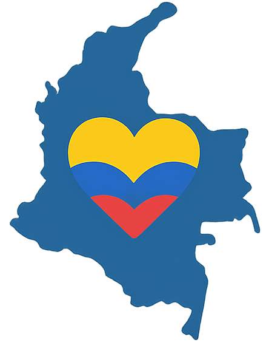
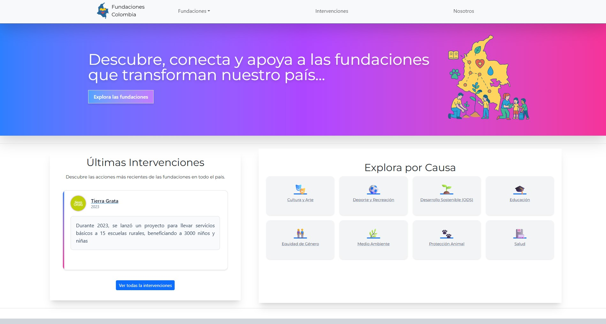

 # Website - *Fundaciones Colombia*

Visit the website: https://fundaciones-colombia.netlify.app/

    
    
 Visit the website: https://fundaciones-colombia.netlify.app/ 
/>

## Description

### Fundaciones Colombia is a web app to easily find the core information about foundations in Colombia. 🇨🇴

At the same time, the platform offers social-media-like features, such as allowing each foundation to share posts about their latest interventions, as well as providing a general feed that gathers updates from all recent interventions across foundations. 📰✨

#### Motivation

I built this web app from scratch as the final project of the Module 2 of a Web Development Bootcamp in Ironhack. The goal for the projects was to implement a solid frontend using React, while the backend relies on a [JSON server](https://www.ironhack.com/). The theme of the app was of free choice.

I chose to build this website, because I have been involved with some NGOs in Colombia and I've noticed two things: 
1. Information about foundations in Colombia seems to be scattered across the internet, I could not find a source that lists them all, and some pages that mention many of them, list them in a plain table form, with no possibility of interaction or filtering.

2. In a country like Colombia—where the social system does not always guarantee people’s rights, where violence and inequality persist, and where remote regions often wait a long time for government aid—foundations become essential actors. They complement, and sometimes even replace, state support, alleviating urgent needs and bringing hope where it’s most needed. 🙌 Yet, this work often goes unnoticed. Many foundations rely on traditional social media, which may not reach all audiences, or their messages get lost in the endless stream of unrelated content. As a result, it’s difficult to highlight the true impact of their interventions. That’s why I thought it was necessary to create a dedicated space where the news is focused exclusively on the good actions, services, and transformations these foundations bring to our society. ✨

## Main Features
Because of the bootcamp project scope and the requirement to use JSON Server, the data in this application is not persistent (added foundations and interventions disappear about 15 minutes after being created). Therefore, the app currently serves as a template or prototype for building a more robust application.

Despite these limitations, the project demonstrates how such a platform could work if extended with a real backend, persistent storage, and user management. 🔧✨

- 📋 Browse a curated list of real Colombian foundations (currently 13)
- 🔎 Search and filter foundations by Colombian department (location) or by cause
- ➕ Add new foundations and interventions (demo mode)
- 📰 View added interventions in the interventions feed
- 🧭 Enjoy easy navigation with a modern UI
- 📱 Responsive design for both mobile and desktop
- 🖥️ JSON Server deployed on [Render](https://render.com/) - server Repo [here](https://github.com/malejaroti/Website-fundaciones-colombia-server).

## Technologies, Libraries & APIs used

HTML, CSS, Typescript, Tailwind, React, axios, Bootstrap. Additional packages used: react-select, react-icons.

## 🔮 Future Development

There is an intention to keep developing this project further. In the backlog of planned features:

- A more scalable backend: Persistent database.
- Foundation accounts with the ability to modify their profile and add interventions.
- User accounts with the ability to add or follow foundations
- Volunteer opportunities posted directly by foundations

# Client Structure

## User Stories

- **Homepage** - As a user I want to be able to access the homepage so that I see what the app is about.

- **Foundations list** - As a user I want to be able to see all foundations listed in a page and see their most important information: Foundation name, logo, description, which causes they address, links to their official social media accounts.

- **Foundation details** - As a user I want to be able to see the information of only one foundation in a single place, with more details and information about their recent interventions.

- **Interventions list** - As a user I want to be able to see a page with all the interventions from all the foundations.

- **Add foundation** - As a website admin or as a new foundation user, I want to be able to add the information of my foundation to the website.

- **Edit foundation** - As a website admin or as a new foundation user, I want to be able to edit the information of my foundation.

- **Add intervention** - As foundation (user), I want to be able to add information about my latests
  interventions.

- **Edit intervention** - As foundation (user), I want to be able to edit the information about my interventions.

- **404** - As a user I want to see a nice 404 page when I go to a page that doesn’t exist so that I know it was my fault

## Client Routes

###  React Router Routes (React App)

| Path                           | Page               | Components                | Behavior                                                                   |
| ------------------------------ | ------------------ | ------------------------- | -------------------------------------------------------------------------- |
| `/`                            | Home               | InterventionsCarousel, CausesSectionHome | Home page: Hero, carousel with latest interventions. grid of clickable causes. |
| `/fundaciones`                 | All Foundations    | MySelect,Chip                          | List all foundations. Search bar and filters by department and cause                        |
| `/fundaciones/:id`             | Foundation details | InterventionCard, Chip                         | Foundation details: Name, description, sociales, causes, type of interventions, latest interventions and button to add new intervention               |
| `/fundaciones/nueva-fundacion` | Add foundation     |                           | Form to add a new foundation                                                                  |
| `/fundaciones/editar-fundacion/:id` | Edit foundation     |                           | Form to edit a foundation                                                                 |
| `/interventions`               | All interventions  | EditProfile               | Lists all interventions from all foundations                         |

## Other Components

- Navbar (React - Bootstrap)
- Footer

## Links

### Project

[Repository Link Client](https://github.com/malejaroti/Website-fundaciones-colombia-client)

[Repository Link Server](https://github.com/malejaroti/Website-fundaciones-colombia-server)

[Deploy Link](https://fundaciones-colombia.netlify.app/)
